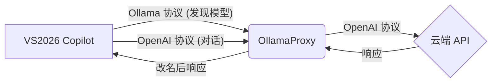

# OllamaProxy
> 一个轻量级代理，把自己伪装成 Ollama 服务，让 VS2026 / SSMS22 的 Copilot 可以使用任意云端大模型（DeepSeek / OpenAI / Claude 等）。

> [English](./README_EN.md)
## 快速开始
### 1. 安装依赖
需要 Python 3.8+ 环境。
```bash
pip install flask requests pyyaml
```
### 2. 创建配置文件
在用户目录下创建配置文件：
- **Windows**: `%USERPROFILE%\.ollama-proxy\config.yaml`
- **Linux/macOS**: `~/.ollama-proxy/config.yaml`
**最小配置示例**：
```yaml
server:
  port: 11434
models:
  - ollama_name: "deepseek-chat"
    upstream_name: "deepseek-chat"
    base_url: "https://api.deepseek.com/v1"
    api_key: "sk-xxxxxxxxxx"
```
### 3. 启动代理
```bash
python proxy.py
```
启动成功后会显示监听地址和模型列表。
### 4. 连接 VS2026 / SSMS22
1. 打开 Copilot Chat 窗口。
2. 点击模型下拉框 → **Manage Models**。
3. 选择 **Ollama** 作为 Provider。
4. 将 Endpoint 设置为：`http://localhost:11434`。
5. 保存后即可在列表中看到配置的模型。
---
## 核心概念
### 架构流程

### 工作原理
VS2026 Copilot 采用**混合协议**模式：
- **模型发现**：使用 Ollama 原生端点 `/api/tags`, `/api/show` 获取模型列表和能力。
- **实际对话**：使用 OpenAI 兼容端点 `/v1/chat/completions` 发送请求。
代理的核心工作是**协议适配与模型名映射**：
1. 拦截 Copilot 请求，根据配置路由到正确的云端 API。
2. 将请求中的模型名`ollama_name`替换为云端真实名`upstream_name`。
3. 将响应中的模型名换回，确保 Copilot 界面显示一致。
---
## 详细配置
### 配置文件查找顺序
程序启动时按以下顺序查找配置文件（优先级由高到低）：
1. 命令行参数：`python proxy.py -c /path/to/config.yaml`
2. 环境变量：`OLLAMA_PROXY_CONFIG=/path/to/config.yaml`
3. 默认路径：`~/.ollama-proxy/config.yaml`
### 完整配置项说明
| 字段 | 必填 | 默认值 | 说明 |
| :--- | :---: | :--- | :--- |
| `ollama_name` | ✅ | - | 对 Copilot 暴露的模型名，可自定义 |
| `upstream_name` | ✅ | - | 上游 API 的真实模型名 |
| `base_url` | ✅ | - | 上游 API 地址（需兼容 OpenAI 格式） |
| `api_key` | ✅ | - | 上游 API 密钥 |
| `context_length` | ❌ | 128000 | 上下文窗口大小，报告给 Copilot |
| `capabilities` | ❌ | `["completion"]` | 模型能力：`completion`, `tools`, `vision` |
### 完整配置示例
包含服务器配置与多模型配置的完整示例：
```yaml
server:
  host: "127.0.0.1"   # 监听地址
  port: 11434         # 监听端口
  timeout: 120        # 请求超时时间 (秒)
models:
  # DeepSeek 完整配置示例
  - ollama_name: "deepseek-v3"
    upstream_name: "deepseek-chat"
    base_url: "https://api.deepseek.com/v1"
    api_key: "sk-xxxxxxxx"
    context_length: 128000        # 可选：上下文窗口大小
    capabilities: [completion, tools] # 可选：模型能力
  # Claude 配置示例
  - ollama_name: "claude-sonnet"
    upstream_name: "claude-sonnet-5-20251001"
    base_url: "https://api.anthropic.com/v1"
    api_key: "sk-ant-xxxxxxxx"
    context_length: 200000
    capabilities: [completion, tools, vision]
```
---
## API 端点说明
代理服务根据功能分为两类端点：
### 1. 模型发现 (Ollama 协议)
用于响应 Copilot 的模型列表查询和能力检测请求。

| 端点 | 方法 | 说明 |
| :--- | :---: | :--- |
| `/` | GET | 探测服务存活，返回版本号 |
| `/api/tags` | GET | 返回配置文件中的模型列表 |
| `/api/show` | POST | 返回模型详情（上下文长度、能力） |
| `/v1/models` | GET | OpenAI 格式的模型列表（兼容备用） |
### 2. 对话通信 (OpenAI 协议)
Copilot 实际发起对话的端点，代理会替换模型名并透传。
| 端点 | 方法 | 说明 |
| :--- | :---: | :--- |
| `/v1/chat/completions` | POST | **核心端点**，VS2026 Copilot 实际使用 |
| `/api/chat` | POST | 原生 Ollama 格式（含格式转换，供其他客户端使用） |
## 验证测试
使用 `curl` 快速测试连通性：
```bash
# 1. 获取模型列表
curl http://localhost:11434/api/tags
# 2. 测试对话 (OpenAI 格式)
curl http://localhost:11434/v1/chat/completions \
  -H "Content-Type: application/json" \
  -d '{"model": "deepseek-chat", "messages": [{"role": "user", "content": "Hi"}], "stream": false}'
```
## 许可证
[MIT License](https://opensource.org/licenses/MIT) © ZY
