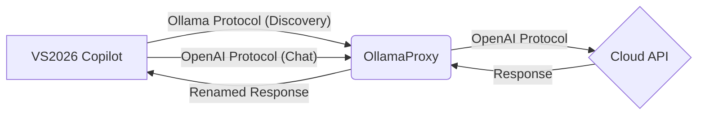

# OllamaProxy
> A lightweight proxy that masquerades as an Ollama service, allowing VS2026 / SSMS22 Copilot to use any cloud-based LLM (DeepSeek / OpenAI / Claude, etc.).

> [中文](./README.md)
## Quick Start
### 1. Install Dependencies
Requires Python 3.8+ environment.
```bash
pip install flask requests pyyaml
```
### 2. Create Configuration File
Create the configuration file in the user's home directory:
- **Windows**: `%USERPROFILE%\.ollama-proxy\config.yaml`
- **Linux/macOS**: `~/.ollama-proxy/config.yaml`
**Minimal Configuration Example**:
```yaml
server:
  port: 11434
models:
  - ollama_name: "deepseek-chat"
    upstream_name: "deepseek-chat"
    base_url: "https://api.deepseek.com/v1"
    api_key: "sk-xxxxxxxxxx"
```
### 3. Start the Proxy
```bash
python proxy.py
```
Upon successful startup, the listening address and model list will be displayed.
### 4. Connect VS2026 / SSMS22
1. Open the Copilot Chat window.
2. Click the model dropdown → **Manage Models**.
3. Select **Ollama** as the Provider.
4. Set the Endpoint to: `http://localhost:11434`.
5. Save, and the configured models will appear in the list.
---
## Core Concepts
### Architecture Flow

### Working Principle
VS2026 Copilot adopts a **Hybrid Protocol** mode:
- **Model Discovery**: Uses native Ollama endpoints (`/api/tags`, `/api/show`) to get the model list and capabilities.
- **Actual Chat**: Uses OpenAI compatible endpoints (`/v1/chat/completions`) to send requests.
The proxy's core job is **Protocol Adaptation and Model Name Mapping**:
1. Intercept Copilot requests and route them to the correct cloud API based on configuration.
2. Replace the model name (`ollama_name`) in the request with the real cloud name (`upstream_name`).
3. Swap the model name back in the response to ensure consistency in the Copilot interface.
---
## Detailed Configuration
### Configuration File Search Order
The program looks for the configuration file in the following order (highest to lowest priority):
1. Command-line argument: `python proxy.py -c /path/to/config.yaml`
2. Environment variable: `OLLAMA_PROXY_CONFIG=/path/to/config.yaml`
3. Default path: `~/.ollama-proxy/config.yaml`
### Full Configuration Items
| Field | Required | Default | Description |
| :--- | :---: | :--- | :--- |
| `ollama_name` | ✅ | - | Model name exposed to Copilot, customizable |
| `upstream_name` | ✅ | - | Real model name of the upstream API |
| `base_url` | ✅ | - | Upstream API address (must be OpenAI compatible) |
| `api_key` | ✅ | - | Upstream API key |
| `context_length` | ❌ | 128000 | Context window size, reported to Copilot |
| `capabilities` | ❌ | `["completion"]` | Model capabilities: `completion`, `tools`, `vision` |
### Full Configuration Example
A complete example containing server configuration and multiple model configurations:
```yaml
server:
  host: "127.0.0.1"   # Listening address
  port: 11434         # Listening port
  timeout: 120        # Request timeout (seconds)
models:
  # DeepSeek Full Configuration Example
  - ollama_name: "deepseek-v3"
    upstream_name: "deepseek-chat"
    base_url: "https://api.deepseek.com/v1"
    api_key: "sk-xxxxxxxx"
    context_length: 128000        # Optional: Context window size
    capabilities: [completion, tools] # Optional: Model capabilities
  # Claude Configuration Example
  - ollama_name: "claude-sonnet"
    upstream_name: "claude-sonnet-5-20251001"
    base_url: "https://api.anthropic.com/v1"
    api_key: "sk-ant-xxxxxxxx"
    context_length: 200000
    capabilities: [completion, tools, vision]
```
---
## API Endpoints
The proxy service provides two categories of endpoints:
### 1. Model Discovery (Ollama Protocol)
Used to respond to Copilot's model list queries and capability detection requests.
| Endpoint | Method | Description |
| :--- | :---: | :--- |
| `/` | GET | Health check, returns version number |
| `/api/tags` | GET | Returns model list from configuration |
| `/api/show` | POST | Returns model details (context length, capabilities) |
| `/v1/models` | GET | OpenAI format model list (compatibility fallback) |
### 2. Chat Communication (OpenAI Protocol)
Endpoints where Copilot actually initiates dialogue. The proxy swaps model names and passes through requests.
| Endpoint | Method | Description |
| :--- | :---: | :--- |
| `/v1/chat/completions` | POST | **Core Endpoint**, used by VS2026 Copilot |
| `/api/chat` | POST | Native Ollama format (includes format conversion for other clients) |
## Verification & Testing
Use `curl` to quickly test connectivity:
```bash
# 1. Get model list
curl http://localhost:11434/api/tags
# 2. Test chat (OpenAI format)
curl http://localhost:11434/v1/chat/completions \
  -H "Content-Type: application/json" \
  -d '{"model": "deepseek-chat", "messages": [{"role": "user", "content": "Hi"}], "stream": false}'
```
## License
[MIT License](https://opensource.org/licenses/MIT) © ZY
